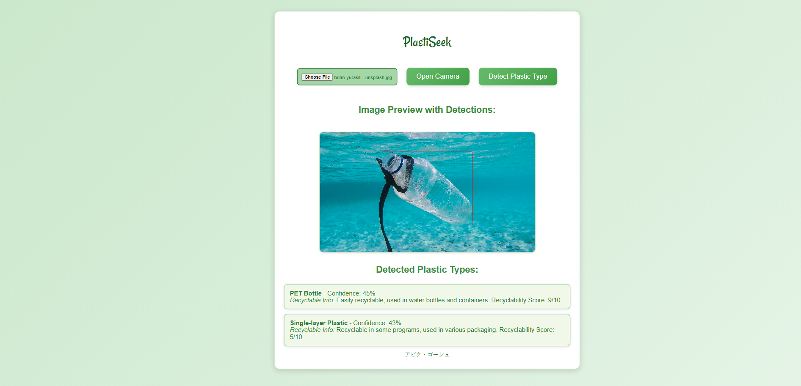
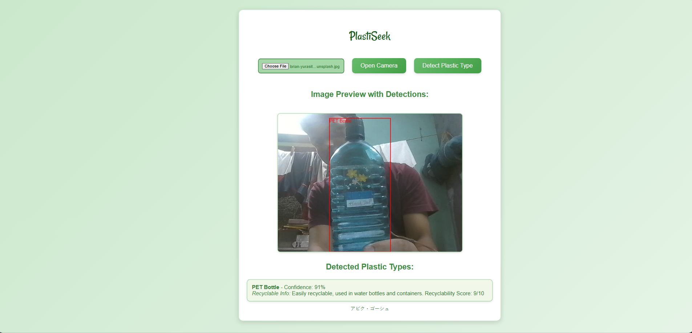

# 🌍 Green Wave - Plastic Detection App

Welcome to **Green Wave**, a React application for detecting and classifying plastic types using a pre-trained machine learning model. This tool is designed to help you identify various plastic types from images and understand their recyclability.

## 🚀 Features

- **Image Upload**: Allows users to upload images of plastic items for analysis.
- **Plastic Detection**: Uses a machine learning model to detect and classify different types of plastics within the image.
- **Recyclability Information**: Provides information about the recyclability of detected plastic types.
- **Image Preview**: Displays the uploaded image with bounding boxes around detected plastic types.

## 🔧 How It Works

1. **Upload an Image**: Choose an image file that contains plastic items. The app supports various image formats.
2. **Submit for Analysis**: Upon submission, the image is sent to a machine learning model via the Roboflow API.
3. **Receive Predictions**: The model returns the detected plastic types along with confidence scores.
4. **Display Results**: Bounding boxes are drawn around detected plastic items in the image, and a list of detected types with their recyclability information is shown.

## 🎯 Use Cases

- **Environmental Projects**: Ideal for applications focused on waste management, recycling initiatives, and environmental conservation.
- **Educational Tools**: Useful for teaching about plastic types and recycling processes.
- **Product Development**: Can be integrated into apps or platforms aimed at improving waste sorting and recycling efficiency.

## 📜 Recyclable Properties

Here is a brief overview of the recyclable properties associated with each plastic type detected by the app:

- **PET Bottle**: Easily recyclable, used in water bottles and containers.
- **HDPE**: Widely recyclable, used in milk jugs, detergent bottles.
- **PVC**: Recyclable in some areas, often used for pipes and cable insulation.
- **LDPE**: Recyclable in some programs, used in plastic bags and films.
- **PP**: Recyclable, used in yogurt containers and bottle caps.
- **PS**: Difficult to recycle, used in foam cups and containers.
- **Other**: Not easily recyclable, used in multi-material plastics.

## 📸 Screenshots

_Example of an image with detected plastic types._

_Example of the detected plastic types and their recyclability information._

## 📝 License

This project is open-source and available under the MIT License. Feel free to modify, distribute, and use it as needed.
